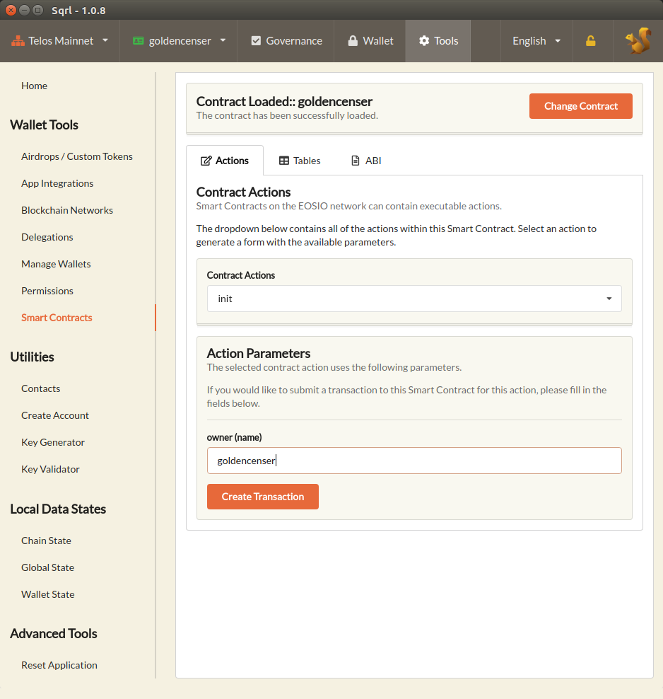
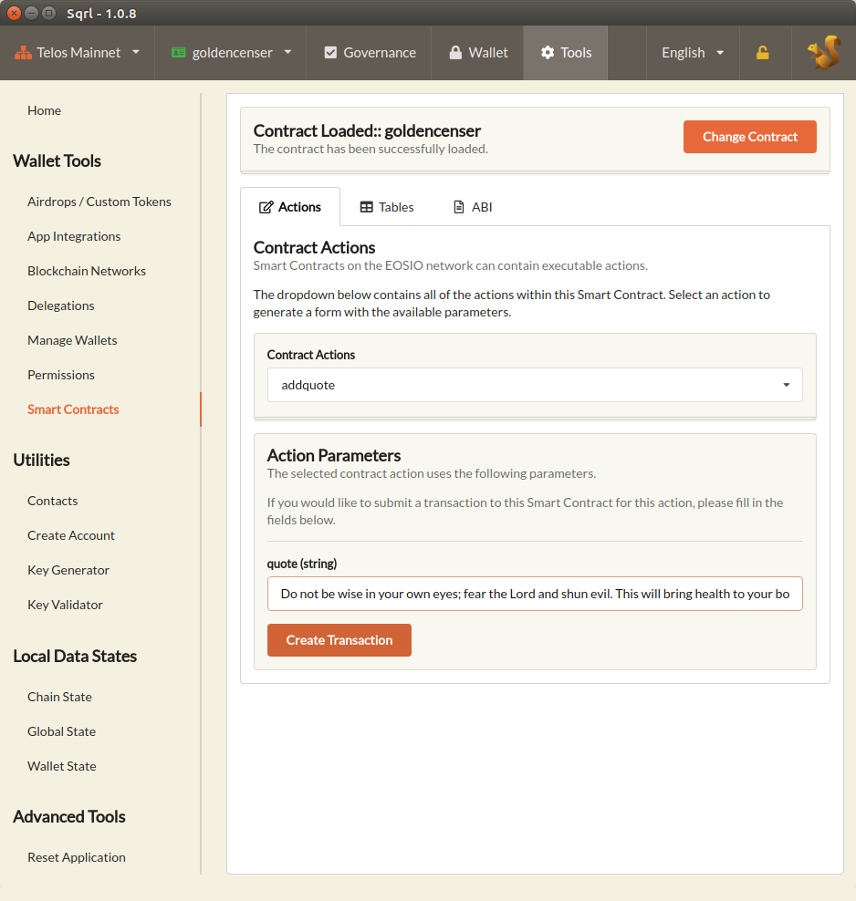
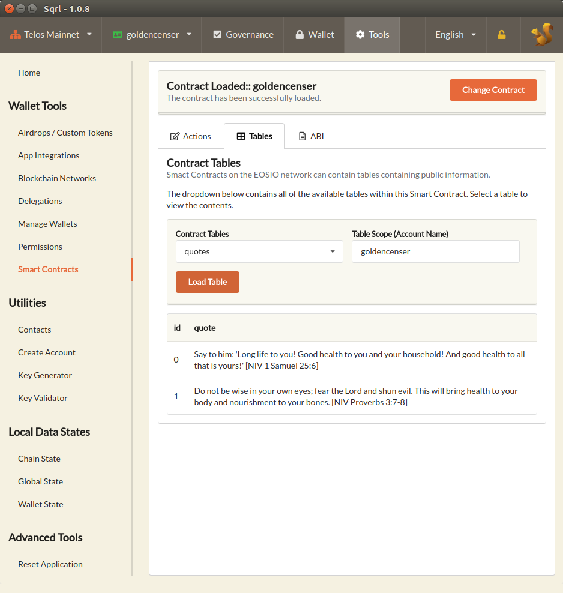

# goldencenser-heart-token-response
Source code for the "Golden Censer" for HEART token that runs on Telos Network.

# how to use it

## - init action
The first action to be called is **init** which receives the name of the owner of this smart contract. It can be any valid account name but for this example, I'm going to use the same name of the contract.

## - addquote action
What the owner should do next is add a lot of quotes one by one calling the **addquote** for that. The only account allowed to modify in any way the table of quotes is the account declared in previous step (**init**).

## - modifyquote action
Each quote has its own internal id and can be referenced by that id. If the owner wants, he or she can modify any quote by executing **modifyquote** referencing the quote by its id.

## - removequote action
Each quote can be removed individually by calling the **removequote** action with the id of the quote to delete.

## - reset action
If the owner decides to refresh the entire set of quotes can execute reset to delete all registered quotes and start fresh new. It can happen that the amount of the quotes to delete at once may be too high, which may cause a timeout exception *the transaction took too long* and therefore force deletion one by one. To avoid that problem, the owner must enter an integer to determine the maximum amount of quotes to be deleted. That allows the owner to delete all the quotes by calling once, twice or tree times at most specifying a relative high max number that allows the action to finish successfully.

## - newowner action
The ownership can be transfered to another account by calling **newowner** action by the current owner, adding the name of the new owner.

## quotes table 

